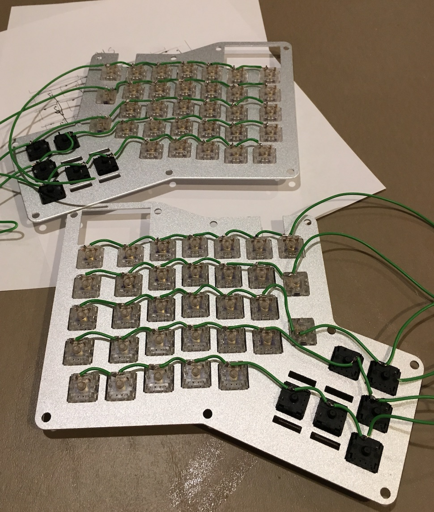
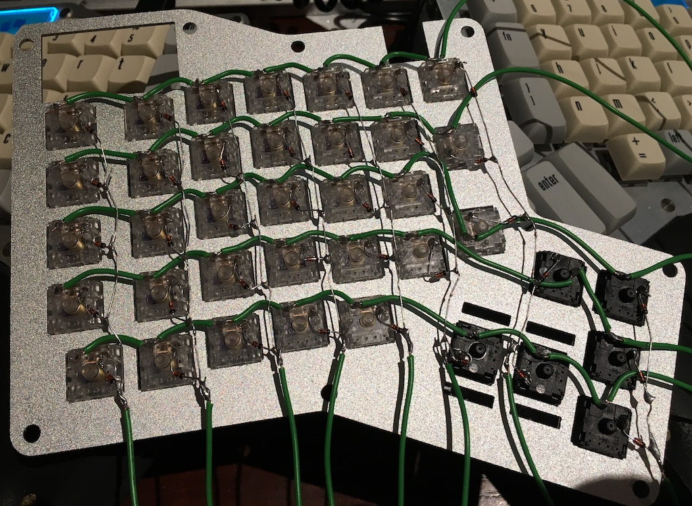

# ErgoBlue

Stuff for a fully wireless ErgoDox based on a
[Gist](https://gist.github.com/wez/b30683a4dfa329b86b9e0a2811a8c593) from the
fabulous Wez Furlong.  If you read Wez's Gist, he explains some of this. I'm
going to document what I'm doing as I go.

This is my first time doing anything real with Arduino or low level electronics
at all. So some of this stuff will be absurdly more detailed that it probably
needs to be, but I'm also an experienced software developer, so I'll gloss over
a bunch of stuff that seems simple to me (but may not be to you, dear reader).
Apologies in advance...

## Shopping List
1. **2 [AdaFruit feather nRF52](https://www.adafruit.com/product/3406)'s.**
1. **2 [LiPo batteries](https://www.adafruit.com/product/328) to drive the
wireless modules.** I bought 500 mAh LiPo batteries, because I'm hoping they
will last long enough for me to not have to charge very frequently. I'm a bit of
an idiot, because I didn't realize that they had 2500 mAh LiPo batteries. They
would be better...
1. **A couple of ErgoDox keyboard plates.** I purchased a spare ErgoDox Infinity
from MassDrop a while back (when they were still selling them), just to have
around in case either my home or work keyboard died. I find all the cords for
the ErgoDox *really* annoying, so I decided to grab the keyswitch plates and try
this out. I may wind up changing this keyboard to be a custom build instead. I
find the lack of a decent place to put an 'Arrow T' pretty irritating, as well,
so maybe sometime in the future I'll get as adventurous as Wez and make my own
custom keyboard plate.
1. **About 80 1n4148 'signaling' diodes.** (I bought 250, because they're
cheap). I understand, logically, what a diode is, but I have zero understanding
of the difference between a schottky diode, zener diode, or whatever. Everything
I've read says to just use 1n4148's, so I bought a bunch from DigiKey. I haven't
received them yet, so I'm just reading up on a bunch of stuff, and horsing
around with the AdaFruit devices.
1. **Key Switches.** [Cherry MX Clear](https://www.digikey.com/short/qq2p2d)'s
are what I've used, but I recently acquired a glob of
[Zealios](https://zealpc.net/collections/switches/products/zealio), which are
also firmer than Cherry Brown's, so I'm gonna try the Zealios Purple's on the
main keys, and the Clear's on the thumb clusters.
1. **Key Caps.** I have a bunch of these hanging around, because *I have a
problem*.
1. **A [MicroUSB Cable](http://a.co/31KmMeQ) or two.** Find one in a drawer
somewhere. These things are everywhere, like Easter grass or Christmas Tree
tinsel. They multiply when out of sight, like a weird combination of rabbits,
and Weeping Angels.

## Getting started
To use the AdaFruit devices, I had to download an older version (1.6.14) of the
Arduino IDE. The current version didn't want to let me follow AdaFruit's
directions to get their BSP (Base Software Package?) installed into Arduino.

I also had to jump through a number of hoops to get `nrfutil` functioning
properly.

>I really hate Python, in no small part because every time I cross anything
written in Python, it doesn't work properly on my Mac. This may be because the
Mac is configured by my employer, but fundamentally, there's just a whole pile
of crap to get through if you have a machine that you've tried to use Python on.
Those people might want to take a long hard look at Node. Oops. End Rant.

Once I had the code compiling, I tried installing the drivers for the AdaFruit's
but found myself having to try a variety of different things to get them working
correctly. I'm using a Mac to do all this. Perhaps it's easier on PC (but my PC
died a couple weeks ago, and I don't want to fix it yet...)

Once you've got the AdaFruit devices working, you 'Upload' the "sketch" to each
device. The right hand device is the 'master' and is the name of the keyboard
you'll see when you try to connect it to your computer (or iPad, or phone, or
whatever). The left hand devices is the 'slave' and all it does is communicate
the state of the keys to the master device.

## Designing the matrix
First, go and read about keyboard matrices. There are a number of well written
explanations for how they work. [Here's the one I found that I liked the
most.](http://pcbheaven.com/wikipages/How_Key_Matrices_Works/) The important
points (at least for me) are:
* Each key must be a unique combination of 'row' and 'column'
* You need to make sure to wire the diodes in parallel. If you wire them
serially, things may be unhappy (they may not, but parallel is the right way to
do this.

It has occurred to me that I might be able to cannibalize the ErgoDox PCB's for
some/all of the wiring, but that just seems like a pain, and I'm not ready to
destroy one yet.

I grabbed the DXF for the ErgoDox plate and printed a few out to try to draw a
key matrix I was happy with. First, I drew a plain matrix, like so:

As you can see, I'm a terrible artist, and also screwed up a couple things, but
erasers are helpful. Maybe I'll turn into into something less hand-drawn in the
future. Probably not.

Once I had a matrix that made sense to my brain, I grabbed switches, stuck 'em
in the switch plate, and looked at where the connections go. Based on that, I
drew up a wiring diagram for each side:

Here's the right hand side:

And here's the left:

I know: I'm an artist. My talent is wasted managing a team of brilliant
engineers.

## Now, the work!

### Soldering

First, I stripped wires so they fit across the rows, then soldered them:

The diodes showed up last night, so I soldered them together on the left hand
side. I'm old and  sitting down soldering for a lot time makes my back hurt, so
I've just finished up the left hand side (probably not the smartest, because the
right hand side is the master, here, so I think I have to mess with both chunks
of Wez's code now. Here's the left hand side all dioded (that's a word!) up.

### Case Design

I've already got a Fusion 3D project for my ErgoDox to build a nice hardwood
case.  Based on that, I've added carve-outs for the battery & AdaFruit in the
underside of the wrist rest. Time to spin up the CNC machine.

>I have an [E3 CNC from BobsCNC](https://www.bobscnc.com). They kit came with a
damanged piece, which they replaced quickly after a quick conversation on FB
Messenger.  The device itself is capable, but it's clearly focused on simple
engraving kind of stuff. The router is a wee bit under powered, but the real
issue is that the gantry (look, Ma, official words!) is just not sturdy enough
to handle something more powerful, so it results in things taking a *long* time
to mill, because you have to go really slowly. And going slowly is frequently
*really* hard on both the stock, and the cutter. If I had it to do over again, I
think I'd go with an [X-Carve](https://www.inventables.com/technologies/x-carve)
or [Shapeoko](https://shop.carbide3d.com/collections/machines/shapeoko). I'm
going to wind up upgrading to something much nicer when I haven't purchased so
many other expensive things in a while. If I had either of the other two, I'm
guessing I probably wouldn't be upgrading for a much longer time. Though, I
think the E3 has more Z-Axis distance than either of the other two. Right now,
I'm either going to go with something *really* pricey, or just say something
like the [MillRightCNC Power
Route](https://www.millrightcnc.com/product-page/millright-cnc-power-route) is
all I'll ever need.

I've got a couple of chunks of maple to try out. I'll upload my Fusion 3D
project somewhere accessible (probably not up here: I have no idea how well a
f3d file versions...)

### Software

I have some *seriously* wacky layering going on in my original ErgoDox firmware
but for now, I'm just going to try to get this set up as a normal Mac keyboard
layout, without messing with layers yet (besides: layers are just software,
which is a solvable problem without purchasing stuff...)

Time to dig in to Wez's stuff!

I also need to learn what the Arduino /
AdaFruit API's are doing, because I need an extra pin, and Wez's pin numbers
don't seem to line up with the devices. I probably also need to figure out how
to re-flash them.

## Future Plans

* Add an on/off switch to conserve battery (but only if it's worth while)
* Add an LED or two to indicate layer/mode stuff
* Upload my Fusion 3D project for the wood case

**Useful links**

* [Matt3o's writeup of the BrownFox, the precursor to my wonderful WhiteFox.](https://deskthority.net/workshop-f7/brownfox-step-by-step-t6050.html)

**AdaFruit links**
* [AdaFruit's Feather examples.](https://github.com/adafruit/Adafruit_nRF52_Arduino/tree/master/libraries/Bluefruit52Lib/examples)
* [AdaFruit's nRF52 Learning Guide.](https://learn.adafruit.com/bluefruit-nrf52-feather-learning-guide/)
* [AdaFruit nRF52 Pinout.](https://learn.adafruit.com/bluefruit-nrf52-feather-learning-guide/device-pinout)
